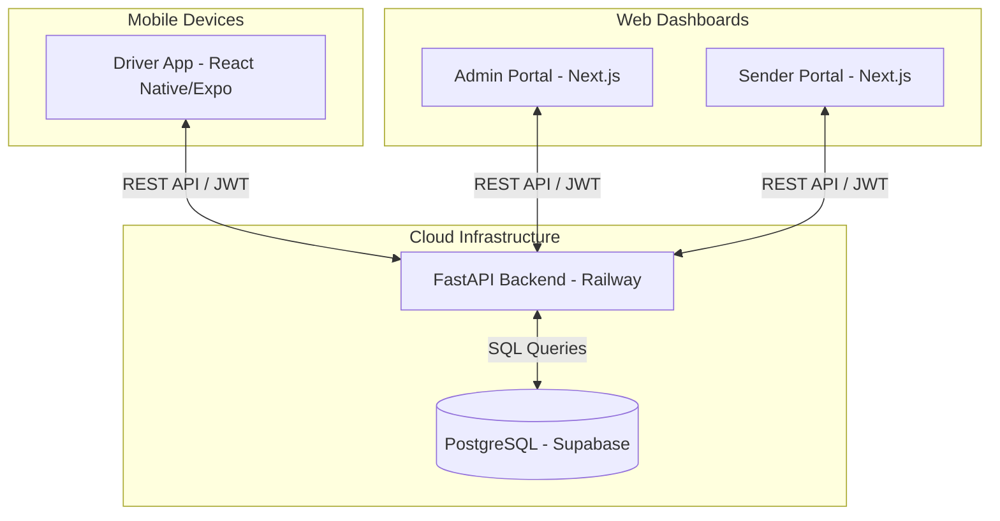

# SmartRoute - Technical Deep Dive & Project Journey

This document outlines the technical implementations, the hurdles faced during development, and the strategies used to overcome them while building the SmartRoute ecosystem.

## 💡 Ideas Implemented

### 1. Dynamic Responsive Scaling (Mobile)
Instead of relying on fixed pixel sizes for fonts and padding (which look great on one phone but break on others), we implemented a custom mathematical scaling utility (`moderateScale`).
- **Implementation:** We mapped the device's screen width against a baseline width (375px) to dynamically calculate sizes.
- **Result:** The UI automatically grows or shrinks to maintain perfect proportions on small phones, large phones, and tablets.

### 2. Custom Authentication Flow
Rather than using a bulky external authentication UI, we built a custom JWT token generator on the FastAPI backend.
- **Implementation:** The backend verifies credentials against the Supabase database, hashes passwords, and signs JWT tokens. The mobile app stores these tokens securely using `AsyncStorage`.

### 3. Background Location & Maps
To make this a true logistics app, drivers need to be tracked even when their phone is locked.
- **Implementation:** We utilized `expo-location` with a registered `BACKGROUND_LOCATION_TASK` alongside `react-native-maps` to provide real-time routing and GPS tracking directly to the backend.

---

## 🚧 Problems Faced & Solutions

### Problem 1: The `passlib` Bcrypt Incompatibility
**Issue:** The backend crashed with a `500 Internal Server Error` during login. The root cause was the `passlib` library, which is heavily outdated and incompatible with the modern `bcrypt` package on Python 3.11+.
**Solution:** We completely ripped out `passlib` from the `security.py` file and wrote a direct wrapper around the raw `bcrypt` library to handle password hashing and verification.

### Problem 2: Massive EAS Cloud Upload Times
**Issue:** When attempting to compile the Android APK via Expo Application Services (EAS) over a mobile hotspot, the upload size was a staggering **708 MB** and projected to take hours. EAS was accidentally zipping up the massive backend Python environments and Next.js web folders.
**Solution:** We created targeted `.easignore` files at the project root to explicitly block the `backend/`, `admin-web/`, and `sender-web/` folders from the mobile build context. 
**Result:** The upload size dropped from **708 MB to 2.1 MB**, and the upload time went from hours to exactly **3 seconds**.

### Problem 3: Hard-coded Local IPs
**Issue:** After successfully building the APK, the app was throwing "Network Errors" upon logging in. The APK had baked in the local computer's IP address (`10.74.167.163`) from an old `.env` file instead of using the live Railway server.
**Solution:** We updated the `driver-apk/.env` file to point directly to `https://smartroute-production.up.railway.app/api/v1` and ran a fresh cloud build, securely baking the production URL into the binary.

### Problem 4: Google Maps Standalone Crashing
**Issue:** While the map worked fine in Expo Go, the standalone APK crashed instantly upon opening the Map Screen. This occurs because native Android builds require explicit background location permissions and a dedicated Google Maps API Key in the Android Manifest.
**Solution:** 
1. Added the `expo-location` plugin to `app.json` to inject the `ACCESS_BACKGROUND_LOCATION` permission into the Android Manifest.
2. Walked through the Google Cloud Console to generate a dedicated Maps SDK API Key and injected it into `app.json` under `android.config.googleMaps.apiKey`.

### Problem 5: Accidental Credential Leak
**Issue:** During testing, a python test script containing live Supabase Service Role keys was accidentally pushed to the public GitHub repository.
**Solution:** We immediately identified the breach, deleted the offending scripts (`test_login.py`, `check_db.py`), and instituted a mandatory key-rotation protocol to secure the database.

---

## 🛠 Refinements & Polish

- **Global Exception Middleware:** Added a global exception handler to `main.py` in the FastAPI backend to catch all unhandled errors and print their exact line numbers and stack traces, making cloud debugging infinitely easier.
- **Premium UI Overhaul:** Rebuilt the React Native app theme using glassmorphism concepts, modern typography (Inter/Roboto), and subtle shadows to give the app a premium, enterprise-level feel.
- **Branding:** Generated a custom icon (`icon.png`) for the driver app and properly configured it in `app.json` so the installed APK looks completely professional on the Android home screen.

---

## 🏗 Architecture Diagram

