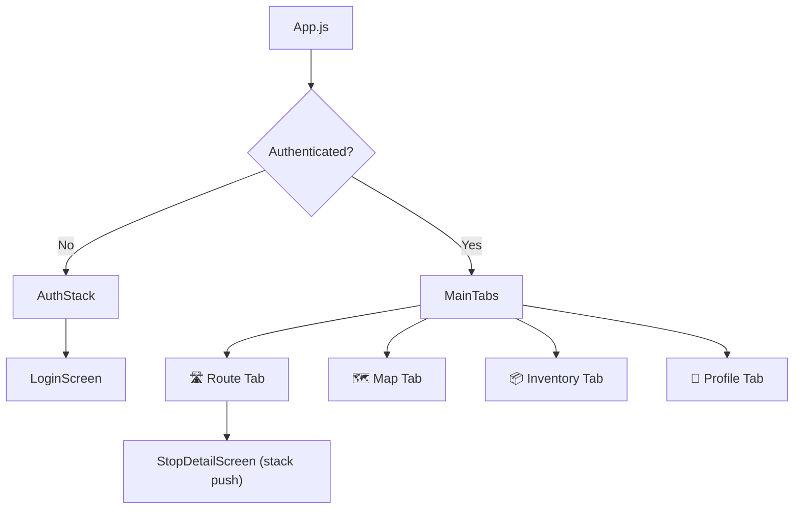
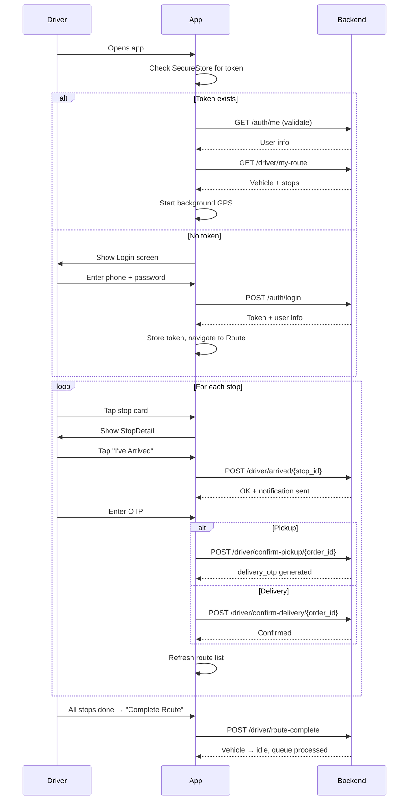

# SmartRoute — Driver Mobile App Implementation Plan

## Goal

Build a React Native (Expo) mobile app for delivery drivers to execute their assigned routes — viewing stops, confirming pickups/deliveries via OTP, tracking location, and managing inventory.

---

## Tech Stack

| Layer | Choice | Why |
|---|---|---|
| Framework | React Native + Expo (managed workflow) | Cross-platform, fast iteration, OTA updates |
| Navigation | `@react-navigation/native` + bottom tabs + stack | Industry standard for RN |
| Maps | `react-native-maps` (via `expo`) | Native MapView, marker, polyline support |
| HTTP | `axios` | Interceptors for auth token, clean error handling |
| State | React Context + `useReducer` | Sufficient complexity; avoids Redux boilerplate |
| Auth Storage | `expo-secure-store` | Encrypted token storage on device |
| Background GPS | `expo-location` (background task) | Battery-efficient location updates |
| Icons | `@expo/vector-icons` (MaterialCommunityIcons) | Bundled with Expo |
| Fonts | `expo-font` + Inter from Google Fonts | Clean, modern typography |

---

## User Review Required

> [!IMPORTANT]
> **Map Provider**: The plan uses `react-native-maps` which defaults to Google Maps on Android and Apple Maps on iOS. For Google Maps on both platforms, we'd need a **Google Maps API key**. Do you want:
> - (A) Google Maps on both platforms (need API key)
> - (B) Default provider (Google on Android, Apple on iOS) — no key needed for development

> [!IMPORTANT]
> **Backend URL**: The brief says `http://localhost:8000`. For testing on a physical device, we'll need the machine's LAN IP (e.g., `http://192.168.x.x:8000`). Should I make this configurable via an environment variable?

> [!WARNING]
> **Background GPS on iOS**: `expo-location` background tracking works but requires specific `Info.plist` permissions and Apple review justification. Fine for development, but worth noting for App Store submission later.

---

## Open Questions

> [!IMPORTANT]
> **Offline Handling**: Should the app work offline (cache route data, queue OTP confirmations)? Or is it safe to assume the driver always has connectivity? This significantly impacts architecture.

> [!NOTE]
> **Push Notifications**: The backend currently uses stub notifications (prints to console). Should the app poll for route changes, or will you add push notifications (FCM/APNs) later? For now I'll implement **pull-to-refresh + auto-refresh on key actions**.

> [!NOTE]
> **Fail Flows UI**: The backend supports `fail-pickup` and `fail-delivery`. Should these be prominent buttons on the stop detail screen, or tucked behind a menu/long-press to prevent accidental taps?

---

## Project Structure

```
driver-app/
├── app.json                    # Expo config
├── App.js                      # Root — providers, navigation
├── babel.config.js
├── package.json
│
├── src/
│   ├── api/
│   │   ├── client.js           # Axios instance with auth interceptor
│   │   ├── auth.js             # login()
│   │   ├── driver.js           # myRoute(), myInventory(), arrived(), confirmPickup(), confirmDelivery(), routeComplete()
│   │   ├── vehicles.js         # updateLocation(), getSegments()
│   │   └── orders.js           # failPickup(), failDelivery()
│   │
│   ├── context/
│   │   ├── AuthContext.js      # Token, user info, login/logout actions
│   │   └── RouteContext.js     # Current route, stops, vehicle, refresh logic
│   │
│   ├── navigation/
│   │   ├── AppNavigator.js     # Auth check → Login stack or Main tabs
│   │   ├── AuthStack.js        # Login screen
│   │   └── MainTabs.js         # Bottom tabs: Route, Map, Inventory, Profile
│   │
│   ├── screens/
│   │   ├── LoginScreen.js
│   │   ├── RouteScreen.js      # Stop list (home)
│   │   ├── StopDetailScreen.js # Arrive, OTP, order details
│   │   ├── MapScreen.js        # Full map with polylines
│   │   ├── InventoryScreen.js  # Items in vehicle
│   │   └── ProfileScreen.js    # Driver info, logout
│   │
│   ├── components/
│   │   ├── StopCard.js         # Individual stop in the list
│   │   ├── OTPInput.js         # 6-digit OTP entry
│   │   ├── StatusBadge.js      # Color-coded status pill
│   │   ├── RouteCompleteBar.js # Floating button when all stops done
│   │   └── LoadingOverlay.js   # Full-screen spinner
│   │
│   ├── services/
│   │   └── locationService.js  # Background GPS task registration
│   │
│   ├── hooks/
│   │   ├── useLocation.js      # Foreground location hook
│   │   └── useRefresh.js       # Pull-to-refresh helper
│   │
│   ├── theme/
│   │   └── index.js            # Colors, typography, spacing tokens
│   │
│   └── utils/
│       ├── constants.js        # API_BASE_URL, intervals
│       └── helpers.js          # formatAddress, decodeGeoJSON, etc.
```

---

## Navigation Architecture



- **AuthStack**: Simple stack with just the login screen
- **MainTabs**: Bottom tab navigator with 4 tabs
- **StopDetailScreen**: Pushed on top of Route tab's stack when a stop is tapped

---

## Proposed Changes

### 1. Project Initialization

#### [NEW] `driver-app/` (entire Expo project)

Initialize with `npx create-expo-app@latest ./driver-app --template blank`.

Install dependencies:
- `@react-navigation/native`, `@react-navigation/bottom-tabs`, `@react-navigation/native-stack`
- `react-native-maps`, `expo-location`, `expo-secure-store`, `expo-font`
- `axios`
- `react-native-safe-area-context`, `react-native-screens`, `react-native-gesture-handler`

---

### 2. API Layer (`src/api/`)

#### [NEW] [client.js](file:///d:/LogisticSid-main/smartroute/driver-app/src/api/client.js)

Axios instance with:
- `baseURL` from constants
- Request interceptor: attaches `Authorization: Bearer <token>` from SecureStore
- Response interceptor: on 401, clear token and redirect to login

#### [NEW] [auth.js](file:///d:/LogisticSid-main/smartroute/driver-app/src/api/auth.js)

```js
login(phone, password) → { access_token, user_id, role, name }
```

#### [NEW] [driver.js](file:///d:/LogisticSid-main/smartroute/driver-app/src/api/driver.js)

Maps 1:1 to your backend endpoints:
- `getMyRoute()` → `GET /driver/my-route`
- `getMyInventory()` → `GET /driver/my-inventory`
- `arrivedAtStop(stopId)` → `POST /driver/arrived/{stop_id}`
- `confirmPickup(orderId, otp)` → `POST /driver/confirm-pickup/{order_id}`
- `confirmDelivery(orderId, otp)` → `POST /driver/confirm-delivery/{order_id}`
- `routeComplete()` → `POST /driver/route-complete`

#### [NEW] [vehicles.js](file:///d:/LogisticSid-main/smartroute/driver-app/src/api/vehicles.js)

- `updateLocation(vehicleId, lat, lng)` → `PATCH /vehicles/{vehicle_id}/location`
- `getSegments(vehicleId)` → `GET /vehicles/{vehicle_id}/segments`

#### [NEW] [orders.js](file:///d:/LogisticSid-main/smartroute/driver-app/src/api/orders.js)

- `failPickup(orderId)` → `PATCH /orders/{order_id}/fail-pickup`
- `failDelivery(orderId)` → `PATCH /orders/{order_id}/fail-delivery`

---

### 3. State Management (`src/context/`)

#### [NEW] [AuthContext.js](file:///d:/LogisticSid-main/smartroute/driver-app/src/context/AuthContext.js)

State: `{ token, userId, userName, role, isLoading }`

Actions:
- `login(phone, password)` — calls API, stores token in SecureStore, sets state
- `logout()` — clears SecureStore, resets state
- `restoreToken()` — called on app start, reads SecureStore

#### [NEW] [RouteContext.js](file:///d:/LogisticSid-main/smartroute/driver-app/src/context/RouteContext.js)

State: `{ vehicle, stops, segments, inventory, isLoading, error }`

Actions:
- `fetchRoute()` — calls `getMyRoute()`, sorts stops by sequence
- `fetchSegments()` — calls `getSegments(vehicleId)` for map polylines
- `fetchInventory()` — calls `getMyInventory()`
- `refreshAll()` — fetches route + segments + inventory together

Auto-computes:
- `nextStop` — first stop where `is_done === false`
- `allDone` — all stops have `is_done === true`
- `completedCount / totalCount` — progress bar data

---

### 4. Screens

#### [NEW] [LoginScreen.js](file:///d:/LogisticSid-main/smartroute/driver-app/src/screens/LoginScreen.js)

- Phone number input (numeric keyboard)
- Password input (secure)
- Login button with loading state
- Error display for wrong credentials / account pending approval
- SmartRoute branding at top

#### [NEW] [RouteScreen.js](file:///d:/LogisticSid-main/smartroute/driver-app/src/screens/RouteScreen.js)

- **Header**: "Today's Route" + progress indicator (e.g., "3/8 stops done")
- **FlatList** of `StopCard` components, sorted by `sequence`
- Each card shows:
  - Color indicator: 🟢 pickup / 🔴 delivery
  - Address (pickup or delivery depending on type)
  - Sequence number badge
  - ✅ checkmark if `is_done`
  - Tap → navigate to `StopDetailScreen`
- **Pull-to-refresh** triggers `fetchRoute()`
- **RouteCompleteBar** at bottom when `allDone === true`
  - On tap → calls `POST /driver/route-complete`
  - On success → shows "Route Complete!" celebration, then **polls `getMyRoute()` after 2s delay** to check if queue processing assigned a new batch (backend `BATCH_SIZE=5` means up to 5 new orders can auto-assign)
  - If new route exists → refreshes seamlessly with "New route assigned!" toast
  - If no new route → shows "No more stops today. You're done!" idle state
- **Empty/Idle state** when no route assigned ("No route assigned — waiting for dispatch")

#### [NEW] [StopDetailScreen.js](file:///d:/LogisticSid-main/smartroute/driver-app/src/screens/StopDetailScreen.js)

The core driver interaction screen. Two phases:

**Phase 1 — En route to stop:**
- Mini map showing stop pin + driver position
- Order details card: address, item description, weight, item count, receiver name/phone
- Large **"I've Arrived"** button → calls `POST /driver/arrived/{stop_id}`
- **"Report Issue"** menu (tucked in top-right):
  - "Sender not present" → `failPickup`
  - "Receiver not present" → `failDelivery`

**Phase 2 — At stop (after arrived):**
- OTP input (6 digits, auto-focus, auto-submit on 6th digit)
- If **pickup**: shows "Enter Sender's OTP" → calls `confirmPickup`
- If **delivery**: shows "Enter Receiver's OTP" → calls `confirmDelivery`
- Success animation → auto-navigate back to route list
- Error state for wrong OTP (shake animation)

#### [NEW] [MapScreen.js](file:///d:/LogisticSid-main/smartroute/driver-app/src/screens/MapScreen.js)

- Full-screen `MapView`
- **Driver marker** (blue dot) — from foreground location
- **Stop markers**: green for pickups, red for deliveries, gray if done
- **Route polylines** from `GET /vehicles/{vehicle_id}/segments`:
  - Decode GeoJSON LineString geometry
  - Done segments = gray dashed, remaining = blue solid
- **Fit to markers** button to reset zoom
- Tap a marker → shows callout with address + "Go" button (opens native maps for turn-by-turn)

#### [NEW] [InventoryScreen.js](file:///d:/LogisticSid-main/smartroute/driver-app/src/screens/InventoryScreen.js)

- List of items currently in the vehicle
- Each item shows: order ID (truncated), pickup address, delivery address
- Count badge in tab icon
- Empty state: "Vehicle is empty"
- Pull-to-refresh support

#### [NEW] [ProfileScreen.js](file:///d:/LogisticSid-main/smartroute/driver-app/src/screens/ProfileScreen.js)

- Driver name, phone
- Vehicle info (capacity, max weight)
- GPS status indicator (always on while route is active — **not toggleable**, since backend requires continuous tracking)
- App version
- **Logout** button (with confirmation dialog)

---

### 5. Background GPS (`src/services/locationService.js`)

#### [NEW] [locationService.js](file:///d:/LogisticSid-main/smartroute/driver-app/src/services/locationService.js)

- Uses `expo-location` `TaskManager` for background location
- Registers task `BACKGROUND_LOCATION_TASK`
- On each location update:
  - Reads `vehicleId` from `AsyncStorage`
  - Calls `PATCH /vehicles/{vehicleId}/location` with lat/lng
- Configuration:
  - `accuracy: Location.Accuracy.High`
  - `timeInterval: 15000` (15 seconds)
  - `distanceInterval: 10` (minimum 10m movement)
- **Start** when driver logs in and has an active route
- **Stop** when route is complete or driver logs out

---

### 6. Theme & Design System (`src/theme/`)

#### [NEW] [index.js](file:///d:/LogisticSid-main/smartroute/driver-app/src/theme/index.js)

```
Colors:
  primary:    #2563EB (blue — brand)
  pickup:     #059669 (bold emerald — high contrast on white)
  delivery:   #DC2626 (bold red)
  success:    #16A34A
  warning:    #D97706
  error:      #DC2626
  background: #F8FAFC (off-white)
  surface:    #FFFFFF (card background)
  border:     #E2E8F0 (subtle card borders)
  text:       #0F172A (near-black — max contrast)
  textMuted:  #64748B (slate gray)

Typography:
  Inter font family — medium/semibold weights for outdoor readability
  Sizes: xs(11), sm(13), md(15), lg(18), xl(22), xxl(28)

Spacing:
  xs(4), sm(8), md(16), lg(24), xl(32)
```

**Light theme by default** — high contrast for outdoor daylight readability. Drivers are in sunlight most of the day; dark screens wash out and are hard to read.

---

## Screen Flow Diagram



---

## Verification Plan

### Automated Testing
1. **Expo build check**: `npx expo start` — ensure no build errors
2. **API integration test**: Login → fetch route → confirm a pickup → verify inventory updates
3. **Navigation test**: Verify all tab transitions and stack pushes work

### Manual Verification
1. Run on Expo Go (Android/iOS simulator or physical device)
2. Test with seeded data from your `seed.py` script
3. Verify background GPS updates appear in the `vehicles` table
4. Test OTP flow end-to-end: place order (sender-web) → dispatch → driver picks up with OTP → delivery OTP sent → driver delivers
5. Test fail flows: fail-pickup, fail-delivery, escalation after 2 failures
6. Test edge cases: no route assigned, empty inventory, token expiry
